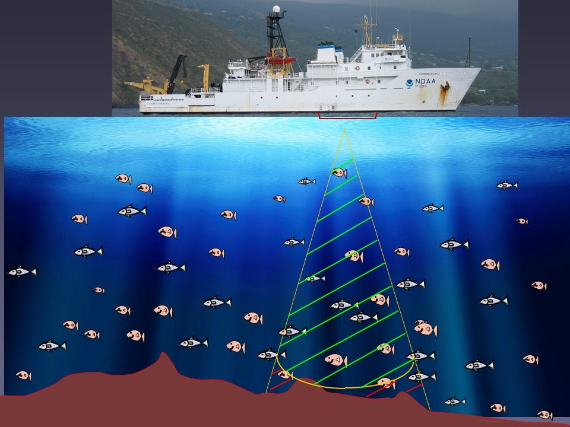

```{r}
#| label: setup-root
#| include: false
library(here)
knitr::opts_knit$set(root.dir = here::here())
cat("Knit root.dir =", getwd(), "\n")

```


# Abstract


Wideband hydroacoustics allows non-invasive monitoring of fish populations, but reliable species-level identification is still challenging without visual confirmation. This project investigates whether frequency-only acoustic signals (45–170 kHz) can accurately classify Lake Trout (LT) and Smallmouth Bass (SMB). Building on earlier work that used a recurrent neural network (RNN) for the same dataset, first replicate that baseline and then extend the analysis using a broader, leakage-safe machine-learning framework.

Summarise each fish’s frequency response curve (FRC) using quantiles and the `tsfeatures` time-series descriptors, then apply H2O AutoML across multiple model families with grouped validation by fish identifier. The best model achieves strong out-of-sample performance (AUC ≈ 0.95–1.00; accuracy up to 0.92 on test), with the upper frequency band (140–160 kHz) provide most to discrimination. Targeted the tuning through out-of-fold threshold optimisation, deep-learning grid search, and frequency-selector features further improves test accuracy and interpretability.

Results shows that wideband frequency-only signatures can reliably separate species, providing a reproducible, operationally deployable workflow for acoustic classification. All analyses are fully scripted in R using `renv` for dependency control and Git LFS for large-data management.

The full analysis workflow and code are openly available on [Github](https://github.com/dulith4/ETC5543-Fish-Hydroacoustics)

#  Introduction & Motivation


Fish hydroacoustics provides a non-destructive way to monitor fish communities by transmitting sound waves underwater and recording the returning echoes. How strongly a fish reflects sound depends on its body shape, tissue composition, and especially the gas-filled swim bladder [@Simmonds2008]. Each fish produces a unique pattern of backscatter strength across frequencies, known as a **Frequency Response Curve (FRC)**, which can be treated like a species “acoustic fingerprint” (@fig-hydro-overview).

{#fig-hydro-overview fig-cap='Simplified schematic of fish hydroacoustics: wideband transmit (45–170 kHz) and echo/backscatter from a fish.' fig-align="center" width=70%}

Reliable fish identification from sonar still difficult when visual confirmation is impractical. If frequency-only signals can separate species accurately, managers could obtain species-specific plenty of estimates without needing for physical capture methods such as netting or tagging. This potential motivates this analysis: determining whether wideband frequency-response data (45–170 kHz) alone can distinguish **Lake Trout (LT)** and **Smallmouth Bass (SMB)**.

Earlier work on the same survey family applied several neural architectures, including fully-connected, convolutional, and recurrent neural networks (RNN/LSTM) to size-standardised backscatter for species classification [@hydro_internal_context_2024]. To ensure a fair comparison, first reproduce the RNN baseline and then extend the analysis using a broader, leakage-safe machine-learning framework that incorporates summarised frequency features and grouped validation.


## **Why use hydroacoustics for classification?**

Hydroacoustics provides many advantages over traditional netting or observation of fishes:

- **Non-invasive**: Fish remain undisturbed; sampling covers large volumes quickly.

- **Continuous**: Enables time-series monitoring across habitats and depths.

- **Quantitative**: Returns fine-tune acoustic strength (Target Strength, TS, in dB) across multiple frequencies.

Because the FRC shape reflects biological differences (e.g., swim bladder size, body composition), species often show interesting frequency-dependent patterns.
This analysis explores whether these patterns recorded between 45–170kHz can distinguish Lake Trout (LT) and Smallmouth Bass (SMB).


**The approach (replicate →→ extend).**

First reproduce a prior frequency-only baseline to compare. Then extend the analysis by (i) constructing robust, fish-level summaries of each frequency-response curve (FRC), (ii) evaluating a diverse set of modern classifiers under grouped validation to prevent leakage, and (iii) applying light, principled tuning and post-hoc threshold setting to support an operational decision rule.

**Contributions**.

**1. Develop a reproducible workflow to classify Lake Trout (LT) and Smallmouth Bass (SMB)** using frequency-only acoustic data.
The workflow concerns **leakage-aware evaluation** and applies a **fixed operational decision threshold** to make sure realistic model assessment.

**2. Compare different representations of FRCs** contrasting **compact statistical summaries** (e.g., quantiles, medians) with **time-series descriptors** that capture the shape and structure of each curve.

**3. Improve explainability by identifying frequency regions most important for classification**, linking these regions to **acoustically usable features** of fish backscatter behavior.

**4. Ensure full reproducibility of all analyses** through a transparent R-based setup using `renv` for environment control and Git LFS for large data management, allowing results to be regenerated much as possible.


#### Research Questions

**Primary Question**

**RQ1.** Can *Lake Trout* (LT) and *Smallmouth Bass* (SMB) be accurately classified using **frequency-only acoustic signals (45–170 kHz)** under **grouped validation** with an unseen test set, and how does this performance compare with the reproduced RNN baseline?

**Secondary Questions**

**RQ2.** Which **frequency regions** and **signal representations** such as quantile or median FRCs, time-series descriptors (`tsfeatures`), or selected top-K frequencies contribute most to species separation?

**RQ3.** What **descriptive ecological patterns** (e.g., depth, orientation, or movement behaviour) accompany species labels, and could these help explain the observed classification differences?

**RQ4.** What are the key **limitations** (e.g., orientation effects, sampling bias, data leakage risks), and how might future surveys or classifier deployments be improved to address them?

**Non-goals.** Morphometric variables (length, weight, etc.) are deliberately excluded from predictive models. Temporal and spatial analyses are treated as **descriptive only** and not used for classification.


# Data & Preparation

## Source and structure

The dataset is provided as an RDS file (`TSresponse_clean.RDS`, tracked via Git LFS) with over **30k rows** and **302 variables**. Each row represents an **Echoview region** a contiguous sequence of pings that the processing software attributes to a single fish encounter. Two identifiers link the data:

- `fishNum` - unique individual; LT/SMB prefix encodes species  
- `Region_name` - encounter identifier within a fish  

The block `F45..F170` contains frequency-specific target strengths (dB) at 45–170 kHz. These constitute the **frequency response curve (FRC)** used for prediction. Additional variables describe geometry or behaviour (e.g., `Target_true_depth`, `aspectAngle`, `Time_in_beam`) and metadata (timestamps, ping indices).

In the **previous study** [@hydro_internal_context_2024], models were trained directly on **ping-level data**, treating each ping as a separate observation. In contrast, this analysis aggregates **all pings belonging to the same fish** before modelling, making the **fish** the unit of analysis. This design reduces within-fish dependence and prevents inflated performance estimates caused by correlated pings from the same individual [@Simmonds2008].

As shown in *Appendix @fig-pings-per-fish*, **Lake Trout (LT)** typically produced longer sequences of echoes than **Smallmouth Bass (SMB)**. This motivated the use of per-fish aggregation (e.g., median and quantile summaries) rather than raw pings for classification.


## Scope decisions

To focus on frequency-only information, I **exclude** morphometric variables (length, weight, etc.) from all predictive models.  
Variables describing geometry or orientation (e.g., depth, `aspectAngle`, `Time_in_beam`) are analysed **descriptively** in the EDA section but **not used as predictors**.  
Later “plus” variants test modest feature extensions, but these still preserve the “frequency-only” focus of the main analysis.


## Cleaning and basic checks

Before feature construction, light cleaning was performed to confirm data consistency.  
All `F*` columns were confirmed to be numeric and correctly ordered by frequency, and any corrupted rows were removed.  
Species labels were standardised to two categories **Lake Trout (LT)** and **Smallmouth Bass (SMB)** and duplicates were removed.  
Basic checks confirmed full frequency coverage and no missing values across the `F45–F170` range.


## Fish-level representations (what trained on)

Construct per-fish summaries to reduce noise and respect the encounter structure of the data.

- **Quantiles of the FRC (quintiles)**:  
  For each fish, summarise its within-fish frequency–response curve (FRC) at **five quantile levels (q20, q40, q60, q80, q100)**.  
  This means that for every frequency bin (`F45`–`F170`), the distribution of per-ping target strengths is compressed into five representative values, giving **five rows per fish**.  
  This approach reduces noise from ping-to-ping fluctuations within each fish while still keeping the full frequency detail intact.  
  - Output artifact: `outputs/tables/fish_freq_quintiles_long.rds`

- **Median FRC**:  
  A single-row-per-fish summary using the **median** of each `F*` across all pings for that fish.  
  This produces a compact representation where each fish contributes one stable FRC profile.


To capture compact shape characteristics, compute a set of time-series descriptors using the `feasts` and `tsfeatures` packages.
Each fish’s FRC treated as an ordered sequence from 45 kHz to 170 kHz is analysed for **short-series properties** such as **autocorrelation (ACF1–ACF3), partial autocorrelation, spectral entropy, stability, and linearity**, producing around 12–15 derived features.
An additional descriptor was introduced later in the extended (“plus”) version as part of the future work

Then generate four main datasets:

1. **quintiles_allfreq_tsfeat** - 5 rows/fish: raw `F*` + tsfeatures  
2. **quintiles_tsfeat_only** - 5 rows/fish: tsfeatures only  
3. **median_allfreq_tsfeat** - 1 row/fish: median `F*` + tsfeatures  
4. **median_tsfeat_only** - 1 row/fish: tsfeatures only  

Later, create **“plus” variants** by using these datasets with **top-K discriminative frequencies** selected on the **training set only** (to avoid leakage).

## **Train/validation/test design (leakage-aware)**

- **Grouping**. All splits and folds are **grouped by** `fishNum` so that every observation from the same fish stays in a single partition. For quintile datasets, the five rows per fish move together.

- **Stratification**. Within groups, stratify by species to maintain balance.

- **Holdout**. Kept an **unseen test set** which includes of entire fish not present in training/validation.

- **Cross-validation**. Model selection uses grouped k-fold CV (typically k=5).

- **Seed**. A fixed seed is used for reproducibility.

This setup ensures that no individual fish appears in more than one data split, preventing artificially high scores caused by within-fish correlations.

## **Preprocessing for modelling**

- **Predictors**. Unless stated otherwise, features are the FRC block (`F45..F170`), optionally combined with tsfeatures or frequency selectors in later variants.

- **Standardisation**. Where model families benefit (e.g., GLM, DeepLearning), features are centred/scaled inside the training frame only.

- **Class label**. `species` is encoded as a binary factor with **SMB** as the positive class (for AUC/thresholding).

- **Artifacts**. Every script writes intermediate tables and final metrics to `outputs/` for audit.

- A robust z-score check *(Appendix @fig-outlier-rug)* confirmed that no individual fish’s median FRC drift beyond |z| = 3 from the species-wide median. So, no outliers were removed, and all fish were retained for downstream modelling.

## **Reproducibility**

- **Environment**. The repository uses renv; `renv.lock` specifies exact package versions.

- **Large files**. The RDS data which is being used here is tracked via **Git LFS**.

- **Fixed randomness**. All random processes (splits, AutoML seeds) use the project seed.

#  **Data Analysis (IDA/EDA)**

```{r}
#| label: setup-dirs
#| echo: false
#| output: false
dir.create(here::here("outputs","cache"), recursive = TRUE, showWarnings = FALSE)

```


```{r}
#| echo: false
#| output: false
#| label: fig-path-check
getwd()
list.files("figures")
file.exists("figures/hydro.png")
file.exists(here::here("reports","figures","hydro.png"))

```


```{r}
#| label: setup-eda
#| include: false
#| message: false
#| warning: false

library(tidyverse); library(here)

# Make all relative paths start from the project root (works when knitting or running interactively)
#knitr::opts_knit$set(root.dir = here::here())

# Locate utils_data.R regardless of folder casing
utils_path <- if (file.exists(here::here("analysis", "utils_data.R"))) {
  here::here("analysis", "utils_data.R")
} else if (file.exists(here::here("Analysis", "utils_data.R"))) {
  here::here("Analysis", "utils_data.R")
} else {
  stop("Cannot find utils_data.R. Check that it exists in 'analysis/' (or 'Analysis/').")
}

source(utils_path)

# Load transformed data 
fish_raw <- load_fish_transformed(
  raw_path  = here::here("data", "TSresponse_clean.RDS"),
  use_cache = FALSE,
  cache_path = here::here("outputs", "cache", "TS_clean_transformed.rds")
)

# Frequency columns, including decimals like F45.5
freq_cols <- names(fish_raw)[stringr::str_detect(names(fish_raw), "^F\\d+(?:\\.\\d+)?$")]
stopifnot(length(freq_cols) > 0)

# Ensure species is LT/SMB factor
if (!"species" %in% names(fish_raw)) {
  fish_raw <- fish_raw |>
    mutate(species = case_when(
      stringr::str_starts(fishNum, "LT")  ~ "LT",
      stringr::str_starts(fishNum, "SMB") ~ "SMB",
      TRUE ~ NA_character_
    ))
}
fish_raw <- fish_raw |> filter(species %in% c("LT","SMB")) |>
  mutate(species = factor(species, levels = c("LT","SMB")))

```

The dataset is moderately unbalanced, containing around 25 Lake Trout (LT) and 32 Smallmouth Bass (SMB.  

The median number of pings per fish differs considerably between species, Lake Trout (LT) have around 650 valid pings on average, while Smallmouth Bass (SMB) have roughly 200. This likely reflects differences in detection or tracking duration during acoustic sampling. To account for this, I use per-fish aggregations (quantiles and medians) instead of raw pings, reducing bias from unequal sample sizes. Detailed summaries are available in Appendix @tbl-balance.


**Species balance and ping sample sizes**


```{r}
#| label: fig-pings-box
#| fig-cap: "Per-fish ping counts by species (jitter overlaid; dashed lines = medians)."
#| fig-width: 6.2
#| fig-height: 4.2


pings_per_fish <- fish_raw |> count(fishNum, species, name = "n_pings")

meds <- pings_per_fish |> group_by(species) |> summarise(med = median(n_pings), .groups="drop")

ggplot(pings_per_fish, aes(x = species, y = n_pings, fill = species)) +
geom_boxplot(outlier.shape = NA, alpha = 0.25) +
geom_jitter(width = 0.12, alpha = 0.5, size = 1.4) +
geom_hline(data = meds, aes(yintercept = med, colour = species), linetype = 2, linewidth = 0.5, show.legend = FALSE) +
labs(x = NULL, y = "Pings per fish") +
theme_minimal(base_size = 12) +
theme(legend.position = "none")

```

The dataset shows a moderate imbalance between the two species, with approximately **25 Lake Trout (LT)** and **32 Smallmouth Bass (SMB)** individuals.

As shown in **@fig-pings-box**, LT typically contribute **many more pings per fish** (median ≈ 650, IQR ≈ 1500) compared with SMB (median ≈ 200, IQR ≈ 600). This difference likely reflects **species-specific detectability or encounter duration** in the hydroacoustic survey. To avoid bias from unequal sample lengths, later in analyses aggregate data **per fish** using quantiles and medians instead of raw ping-level values. Detailed numerical summaries are provided in Appendix @tbl-balance.


**Unsupervised structure of frequency responses**


```{r}
#| label: fig-pca-frc-q100
#| fig-cap: "PCA of q100 (max) FRC per fish. Extreme-echo profile per species."
#| fig-width: 6.8
#| fig-height: 5.2
q100_frc <- fish_raw |>
  group_by(fishNum, species) |>
  summarise(across(all_of(freq_cols), ~ quantile(.x, 1, na.rm = TRUE)), .groups = "drop")

Xq <- q100_frc |> select(all_of(freq_cols)) |> scale() |> as.matrix()
pca_q <- prcomp(Xq, center = FALSE, scale. = FALSE)

scores_q <- as_tibble(pca_q$x[, 1:2]) |>
  bind_cols(q100_frc |> dplyr::select(species))

ve_q <- summary(pca_q)$importance[2, 1:2]
ggplot(scores_q, aes(PC1, PC2, colour = species)) +
geom_point(alpha = 0.8) +
labs(x = sprintf("PC1 (%.0f%%)", 100*ve_q[1]),
y = sprintf("PC2 (%.0f%%)", 100*ve_q[2])) +
theme_minimal(base_size = 12) +
theme(legend.position = "bottom")
```


Unsupervised PCA on **q100 (maximum)** FRC (@fig-pca-frc-q100) shows **partial overlap** between LT and SMB in the first two components.
**PC1** (≈ 77 % variance) represents an overall amplitude or backscatter-level effect across frequencies, while **PC2** (≈ 9 %) captures finer spectral-shape variation.
Although separation is incomplete as expected without species labels this view highlights that wideband FRCs contain somewhat of a noticable structure that later supports **class-aware models** (e.g., discriminant analysis and AutoML classifiers).


## **Single Frequency Summary**

 

```{r}
#| label: fig-onefreq-q60
#| fig-cap: "Single-frequency summary: per-fish *q60 TS* at the most discriminative frequency (by |Cohen’s d|)."
#| fig-width: 6.2
#| fig-height: 4.6

# Compute per-fish quantiles (q60 = median-like)
pf_q60 <- fish_raw |>
  group_by(fishNum, species) |>
  summarise(across(all_of(freq_cols), ~ quantile(.x, 0.6, na.rm = TRUE)), .groups = "drop")

# Effect size across frequencies
effect_size <- function(x, g) {
  x1 <- x[g == levels(g)[1]]; x2 <- x[g == levels(g)[2]]
  n1 <- sum(!is.na(x1)); n2 <- sum(!is.na(x2))
  m1 <- mean(x1, na.rm=TRUE); m2 <- mean(x2, na.rm=TRUE)
  s1 <- stats::var(x1, na.rm=TRUE); s2 <- stats::var(x2, na.rm=TRUE)
  sp <- sqrt(((n1-1)*s1 + (n2-1)*s2) / (n1+n2-2))
  (m1 - m2) / sp
}

eff_q60 <- tibble(
  col = freq_cols,
  freq_khz = parse_number(freq_cols),
  d = purrr::map_dbl(freq_cols, ~ effect_size(pf_q60[[.x]], pf_q60$species))
) |> arrange(desc(abs(d)))

best_col  <- eff_q60$col[1]
best_freq <- eff_q60$freq_khz[1]
best_d    <- eff_q60$d[1]

# 3) Plot 
plot_df <- pf_q60 |>
  select(fishNum, species, !!best_col) |>
  rename(TS = !!best_col)

ggplot(plot_df, aes(species, TS, fill = species)) +
  geom_violin(alpha = 0.25, colour = NA) +
  geom_boxplot(width = 0.25, outlier.shape = NA, linewidth = 0.5) +
  labs(
    x = NULL,
    y = sprintf("TS at %.1f kHz (q60, dB)", best_freq),
    subtitle = sprintf("Cohen’s d (LT − SMB) = %.2f", best_d)
  ) +
  theme_minimal(base_size = 12) +
  theme(legend.position = "none")

```


At approximately **87.5 kHz**, where the per-fish *q60* target strength differs most strongly (Cohen’s d ≈ 0.6), **Lake Trout (LT)** show consistently **higher backscatter** than **Smallmouth Bass (SMB)** (@fig-onefreq-q60).
The violin and boxplots indicate that LT values cluster near −43 to −45 dB, while SMB average slightly weaker (around −46 dB) with a broader spread.

This frequency falls within the **lower–mid band (≈ 80–90 kHz)** one of the same regions later identified by permutation importance as highly discriminative.
Although overlap remains, the consistent offset between fishes confirms that **even a one frequency’s echo strength can hold predictive information**, motivating the use of **frequency-resolved quantiles** in later classification models.

## **Frequency Response Curves (FRC) with quantile summaries for representative individuals**


```{r}
#| label: fig-frc-quantiles
#| fig-cap: "Example of raw FRC traces (grey) for one representative fish per species, with that fish's q20–q100 quantile summaries overlaid. Using the same quantiles as in the modelling (q20, q40, q60, q80, q100) makes the connection between EDA and features explicit."
#| fig-width: 9
#| fig-height: 4.8
#| fig-align: center


# frequency columns (allows decimals like F45.5)
freq_cols <- names(fish_raw)[str_detect(names(fish_raw), "^F\\d+(?:\\.\\d+)?$")]

# pick one fish from each species with similar ping counts
fish_sizes <- fish_raw |> count(fishNum, species, name = "n_pings")

pick_rep <- function(sp) {
  fish_sizes |>
    filter(species == sp) |>
    arrange(abs(n_pings - median(n_pings))) |>  
    slice(1) |> pull(fishNum)
}

lt_id  <- pick_rep("LT")
smb_id <- pick_rep("SMB")
example_ids <- c(lt_id, smb_id)

# long data for raw traces (all pings for the chosen fish in each species) 
raw_long <- fish_raw |>
  filter(fishNum %in% example_ids) |>
  mutate(ping_id = row_number()) |>             
  select(fishNum, species, ping_id, all_of(freq_cols)) |>
  pivot_longer(cols = all_of(freq_cols),
               names_to = "frequency", values_to = "TS") |>
  mutate(frequency = parse_number(frequency))

# per-chosen-fish quantiles: q20, q40, q60, q80, q100 
q_probs <- c(q20 = 0.20, q40 = 0.40, q60 = 0.60, q80 = 0.80, q100 = 1.00)

qdf_fish <- raw_long |>
  group_by(fishNum, species, frequency) |>
  summarise(
    across(
      .cols = "TS",
      .fns  = list(
        q20  = ~ quantile(.x, q_probs["q20"],  na.rm = TRUE),
        q40  = ~ quantile(.x, q_probs["q40"],  na.rm = TRUE),
        q60  = ~ quantile(.x, q_probs["q60"],  na.rm = TRUE),
        q80  = ~ quantile(.x, q_probs["q80"],  na.rm = TRUE),
        q100 = ~ quantile(.x, q_probs["q100"], na.rm = TRUE)
      ),
      .names = "{fn}"
    ),
    .groups = "drop"
  ) |>
  pivot_longer(q20:q100, names_to = "quant", values_to = "TSq")

# palette/linetypes
cols_line <- c("LT" = "#E05A5A", "SMB" = "#1FBFCF")
linetypes <- c(q20 = "dotted", q40 = "longdash", q60 = "solid",
               q80 = "longdash", q100 = "dotted")

ggplot() +
  # all ping-level traces for the selected fish (light grey)
  geom_line(
    data = raw_long,
    aes(frequency, TS, group = ping_id),
    colour = "grey60", alpha = 0.25, linewidth = 0.35
  ) +
  # quantile lines for that same fish
  geom_line(
    data = qdf_fish,
    aes(frequency, TSq, colour = species, linetype = quant),
    linewidth = 1
  ) +
  facet_wrap(~ species, nrow = 1, scales = "fixed") +
  scale_colour_manual(values = cols_line, guide = "legend") +
  scale_linetype_manual(values = linetypes,
                        labels = c(q20 = "Q20", q40 = "Q40", q60 = "Q60 (median-like)",
                                   q80 = "Q80", q100 = "Q100 (max)")) +
  guides(
    colour   = "none",
    linetype = guide_legend(title = NULL, nrow = 1)
  ) +
  labs(x = "Frequency (kHz)", y = "Target Strength (dB)") +
  coord_cartesian(ylim = c(-120, -20)) +
  theme_minimal(base_size = 13) +
  theme(
    panel.grid.minor = element_blank(),
    strip.text = element_text(face = "bold"),
    legend.position = "bottom"
  )

```


Example of raw **frequency response curves (FRCs)** for one randomly selected (with almost equal amount of pings) **Lake Trout (LT)** and one **Smallmouth Bass (SMB)** in the @fig-frc-quantiles.
Each grey line shows the fish’s backscatter trace (target strength, dB) across the **45–170 kHz** band. While the raw traces reveal general signal intensity, their variability and noise make it difficult to make-out species-level structure by eye.
To summarise these complex shapes, I compute **within-fish quantile envelopes** (q20, q40, q60, q80, q100), shown in colour.
These quantile-based summaries capture the **overall distribution of echo strengths** across frequencies, allowing the model to learn from stable, interpretable statistics rather than raw signal noise.
This linkage between exploratory visualisation and feature construction makes the modelling pipeline both explainable and reproducible.


## **Mean frequency response by species (by quantile)**

@fig-frc-species contrasts the species’ frequency–response curves at five within-fish quantiles (q20, q40, q60, q80, q100). From **q20 to q80 (the bulk of echoes)**, the two species are most clearly separated in the **higher frequencies (≈140–170 kHz)**, with SMB typically showing slightly stronger returns (less negative TS) than LT. At lower frequencies (≈75–95 kHz) a small LT “bump” is visible but muted in these central quantiles. In contrast, the **q100 panel (max echoes)** highlights a different picture: LT exhibits a **pronounced low-frequency peak** around **≈50–95 kHz** that rises above SMB, while the high-frequency gap narrows. In short, **each quantile shows a different part of the spectrum** central quantiles emphasize the consistent high-frequency separation; the extreme quantile (q100) captures occasional strong low-frequency echoes that favour LT.

**Implication for modelling.** This pattern supports the choice to use **quintile summaries (q20–q100)** as inputs: the quantiles provide **complementary, not repetitive views** of the same fish, capturing both **typical behaviour** (q20–q80 → high-frequency separation useful for stable classification) and **rare but informative events** (q100 → low-frequency LT peak). Feeding all five quantiles to the models (`quintiles_*` datasets) lets AutoML learn **quantile-specific frequency cues**, which helps explain why the quintile representations perform strongly and why permutation importance later highlights both the 140–160 kHz band and the ≈80–90 kHz region.

```{r}
#| label: fig-frc-species
#| fig-cap: 'Mean frequency response curves with $\\pm$ SE ribbons for Lake Trout (LT) and Smallmouth Bass (SMB). Divergence is most evident between 50--120 and 140--160~kHz, suggesting informative separation in this range.'


#| fig-width: 7
#| fig-height: 5
#| fig-align: center


# prerequisites already in doc:
# - fish_raw (ping-level data with fishNum, species, F* columns)
# - freq_cols and freq_long definitions earlier


# Per-fish quantiles at each frequency (collapse ping noise within fish)
freq_long_fish <- fish_raw |>
  select(fishNum, species, all_of(freq_cols)) |>
  pivot_longer(-c(fishNum, species), names_to = "frequency", values_to = "TS") |>
  mutate(frequency = readr::parse_number(frequency))

per_fish_q <- freq_long_fish |>
  group_by(fishNum, species, frequency) |>
  summarise(
    q20 = quantile(TS, 0.20, na.rm = TRUE),
    q40 = quantile(TS, 0.40, na.rm = TRUE),
    q60 = quantile(TS, 0.60, na.rm = TRUE),
    q80 = quantile(TS, 0.80, na.rm = TRUE),
    q100 = max(TS, na.rm = TRUE),
    .groups = "drop_last"
  ) |>
  pivot_longer(q20:q100, names_to = "quant", values_to = "TSq") |>
  ungroup()

# Across-fish mean + SE for each species/quantile/frequency
summ_q <- per_fish_q |>
  group_by(species, quant, frequency) |>
  summarise(
    mean_TS = mean(TSq, na.rm = TRUE),
    se_TS   = sd(TSq, na.rm = TRUE) / sqrt(dplyr::n()),
    .groups = "drop"
  )

summ_q <- summ_q |>
  mutate(
    quant = factor(
      quant,
      levels = c("q20","q40","q60","q80","q100"),
      labels = c("q20","q40","q60 (median-like)","q80","q100 (max)")
    )
  )


# Plot: LT vs SMB with SE ribbons, faceted by quantile
cols_line <- c("LT" = "#E05A5A", "SMB" = "#1FBFCF")
cols_fill <- c("LT" = scales::alpha("#E05A5A", 0.18),
               "SMB" = scales::alpha("#1FBFCF", 0.18))

ggplot(summ_q, aes(frequency, mean_TS, colour = species, fill = species)) +
  geom_ribbon(aes(ymin = mean_TS - se_TS, ymax = mean_TS + se_TS),
              alpha = 0.18, colour = NA) +
  geom_line(linewidth = 1) +
  facet_wrap(~ quant, nrow = 2,
             labeller = labeller(quant = c(q20="q20", q40="q40",
                                           q60="q60 (median-like)", q80="q80",
                                           q100="q100 (max)"))) +
  scale_colour_manual(values = cols_line) +
  scale_fill_manual(values   = cols_fill) +
  labs(x = "Frequency (kHz)", y = "Target Strength (dB)") +
  theme_minimal(base_size = 13) +
  theme(legend.position = "bottom",
        plot.margin = margin(5,5,0,5))

```


## **Effect size by frequency**  {#sec-effectsize}

@fig-effectsize shows **Cohen’s d values** [@Rice2007] comparing Lake Trout (LT) and Smallmouth Bass (SMB) at each frequency between 45–170 kHz.
Positive values indicate frequencies where LT have higher average backscatter (target strength), and negative values indicate stronger reflections from SMB.

The plot reveals **moderate effect sizes** (0.2–0.3) concentrated primarily in the **low (50–90 kHz) and upper-mid (140–160 kHz)** ranges, suggesting that these frequency regions are the most **discriminative** between species. The consistent periodic pattern across the band also reflects physical resonance effects of the swim bladder and body composition differences.

Later in **@sec-varimp**, this finding is revisited quantitatively using **model-based permutation importance**, which confirms that many of these same frequency bands contribute most strongly to classification accuracy, linking the statistical separation observed here with actual predictive power in the trained models.

Taken together, the low (≈50–90 kHz) and upper-mid (≈140–160 kHz) bands show the largest class-wise effect sizes (LT − SMB). Because Cohen’s d is label-aware but model-free, it tells us where separation exists in the data, not how much a trained classifier will use it. In @sec-varimp I verify this pattern with a model-based permutation importance analysis, asking which frequencies actually drive predictive performance when the classifier is fit to the quintile summaries.”

Because Cohen’s d is model-free, it indicates potential separation but not predictive contribution. In @sec-varimp it confirm that the same 50–90 and 140–160 kHz bands identified in @sec-effectsize are also the most important to the trained model’s AUC

```{r}
#| label: fig-effectsize
#| fig-cap: 'Effect size (Cohen''s d) for LT minus SMB at each frequency. Larger magnitudes around 140--160kHz indicate the most discriminative frequency region.'
#| fig-width: 7
#| fig-height: 4.2
#| fig-align: center


fish_raw <- fish_raw |> mutate(species = factor(species, levels = c("LT", "SMB")))

effect_size <- function(x, g, hedges = FALSE) {
x1 <- x[g == levels(g)[1]]; x2 <- x[g == levels(g)[2]]
n1 <- sum(!is.na(x1)); n2 <- sum(!is.na(x2))
m1 <- mean(x1, na.rm = TRUE); m2 <- mean(x2, na.rm = TRUE)
s1 <- stats::var(x1, na.rm = TRUE); s2 <- stats::var(x2, na.rm = TRUE)
sp <- sqrt(((n1 - 1)*s1 + (n2 - 1)*s2) / (n1 + n2 - 2))
d  <- (m1 - m2) / sp
if (hedges) d <- (1 - 3 / (4*(n1 + n2) - 9)) * d
d
}

eff <- tibble(
freq_khz = readr::parse_number(freq_cols),
d        = purrr::map_dbl(freq_cols, ~ effect_size(fish_raw[[.x]], fish_raw$species))
) |> arrange(freq_khz)

ggplot(eff, aes(freq_khz, d)) +
geom_hline(yintercept = 0, linewidth = 0.4, linetype = 2, colour = "grey50") +
geom_line(linewidth = 0.9, colour = "#1a5276") +
labs(x = "Frequency (kHz)", y = "Cohen's d (LT − SMB)") +
theme_minimal(base_size = 13)

```


#  Feature Engineering

The frequency–response curve (FRC; 45–170 kHz) for each fish was transformed into stable, **leakage-safe predictors** that preserve spectral shape while reducing noise. Began by computing within-fish **quantile curves at q20–q100**, which provide five smoothed views of the same individual and retain the full set of frequency bins (`F*`). In parallel, created a median FRC which a single profile per fish which compresses the encounter into one robust summary while keeping frequency resolution.

Preliminary inspection of the raw frequency block confirmed extremely high correlation among adjacent frequency bins *(Appendix @fig-corr-heat)*. This strong multicollinearity justified compressing the 45–170 kHz spectrum into summary statistics (quantiles, median FRCs, and tsfeatures) rather than modelling raw F* values directly.

Because backscatter values are ordered by frequency, not random, each FRC can be treated as a **short pseudo–time series** [@feasts_pkg; @tsfeatures_pkg]. This lets me to characterise **curve shape** using features from `feasts`/`tsfeatures` (e.g., ACF/PACF summaries, spectral measures, entropy, stability). Then generated both “**all-frequency**” variants (raw `F*` retained alongside shape descriptors) and “**features-only**” variants (shape descriptors without `F*`). Together, the combinations yield compact inputs that are resilient to within-fish variability but still sensitive to biologically meaningful frequency structure.

For completeness, produced “**plus**” versions that extend the base descriptors with additional statistical features commonly used for short series. Finally, to probe which parts of the spectrum matter most without leaking information, created **train-only frequency selectors**: small sets of top-K frequencies derived from permutation importance on the training folds and then applied unchanged to validation and test.

The resulting inventory of model inputs is summarised in @tbl-feature-sets-pretty; “Quintiles” contain five rows per fish, “Median” one row per fish; “allfreq” retains the original `F*` columns, and “tsfeat only” keeps only shape descriptors, with “plus” adding a modest number of extra predictors. 

## **Datasets produced (inventory)**

```{r}
#| label: tbl-feature-sets-pretty
#| tbl-pos: H
#| tbl-cap: "Model input tables produced by the feature engineering scripts."
#| echo: false
#| message: false
#| warning: false

library(tibble) 
library(knitr) 
library(kableExtra)

brief <- function(path, id_cols = c("fishNum","species","quantile","n")) {
  if (!file.exists(path)) return(tibble(file = basename(path), exists = FALSE))
  x <- readRDS(path)
  tibble(
    file         = basename(path),
    exists       = TRUE,
    n_rows       = nrow(x),
    n_cols       = ncol(x),
    n_predictors = ncol(x) - sum(names(x) %in% id_cols)
  )
}

paths <- c(
  "outputs/tables/fish_quintiles_allfreq_tsfeat.rds",
  "outputs/tables/fish_quintiles_tsfeat_only.rds",
  "outputs/tables/fish_median_allfreq_tsfeat.rds",
  "outputs/tables/fish_median_tsfeat_only.rds",
  "outputs/tables/fish_quintiles_allfreq_tsfeat_plus.rds",
  "outputs/tables/fish_quintiles_tsfeat_only_plus.rds",
  "outputs/tables/fish_median_allfreq_tsfeat_plus.rds",
  "outputs/tables/fish_median_tsfeat_only_plus.rds"
)

inv <- paths |>
  map_dfr(brief) |>
  mutate(
    variant = str_remove(file, "\\.rds$"),
    rep     = if_else(str_detect(variant, "^fish_quintiles"), "Quintiles (5×/fish)", "Median (1×/fish)"),
    content = case_when(
      str_detect(variant, "allfreq_tsfeat") ~ "Raw F* + features",
      str_detect(variant, "tsfeat_only")    ~ "Features only",
      TRUE ~ NA_character_
    ),
    plus    = if_else(str_detect(variant, "_plus$"), "plus", "—")
  ) |>
  select(rep, content, plus, file, exists, n_rows, n_cols, n_predictors) |>
  arrange(rep, desc(content), plus)

inv |>
  kbl(format = "latex", booktabs = TRUE, digits = 0,
      col.names = c("Representation","Contents","Extra","File","Exists","Rows","Cols","Predictors")) |>
  kable_styling(latex_options = c("hold_position","striped","scale_down")) |>
  column_spec(4, width = "7cm")   
```

 @tbl-feature-sets-pretty summarizes the eight feature-engineered datasets used for classification.
“Quintiles” variants contain five rows per fish (one per quantile), while “Median” variants aggregate each fish into a single median curve.
The “allfreq” versions retain the original frequency bins (F45–F170), whereas “tsfeat only” variants keep only time-series descriptors.
“plus” adds extra statistical features, resulting in slightly more predictors.


#  Classification Methods


## **Overview and motivation**

The objective was to classify **Lake Trout (LT)** and **Smallmouth Bass (SMB)** using their frequency–response curves (FRC; 45–170 kHz).
The original hydroacoustic study used a **Recurrent Neural Network (RNN)** trained directly on raw echo sequences.
In this project replicated that baseline for comparison and then extended it by transforming each fish’s wideband response into summary- and descriptor-based features that allow classical machine-learning models (AutoML) [@h2o_docs_2025] to capture species-specific spectral patterns more robustly.

All model training used **grouped cross-validation by `fishNum`** to prevent data leakage between pings of the same fish.

## **Implementation overview**

**Data representation**. Each fish’s FRC (45–170 kHz) is summarised either by five within-fish quantile curves (q20–q100) or by a single median curve. For each representation compute time-series descriptors on the ordered frequency trace, producing variants that either retain the raw frequency bins (`F*`) alongside descriptors or use only the descriptors.


**Model families and evaluation**. Then benchmark `H2O` learners (GLM, Random Forest, GBM, and DeepLearning) using **grouped cross-validation by** `fishNum` and an **unseen test set** held out at the fish level. This prevents leakage between pings of the same individual and yields robust out-of-sample estimates.

**Tuning and interpretability**. AutoML exploration is converted into a single usable model by **out-of-fold threshold optimisation** with a sensible **policy window of 0.40–0.70** to avoid extreme thresholds. A focused **deep-learning grid** filter architecture choices, and **train-only frequency selectors** provide diagnostic insight. 

## **Baseline: RNN replication**

To reproduce the earlier project approach, here implemented an **LSTM-based RNN** (Long Short-Term Memory) that processes short sequences of consecutive pings. The data is not simillar to what the original project did.
Each input sequence contained raw ping values across frequencies (**F45–F170**) for a single fish, allowing the network to learn temporal dependencies across consecutive echoes.

```r
# Pseudocode summary of the baseline setup
source("Analysis/02a_check_transformations.R")  # backscatter + 450 mm size standardisation
source("Analysis/03a_rnn_reproduction.R")       # train/test LSTM sequence model
```

The RNN served purely as a **baseline** for sequence-level learning.
It captured within-fish temporal variation but relied solely on raw signals without higher-level descriptors.


## **AutoML on raw backscatter**

To benchmark classical ensemble learners, the same cleaned data were used in **H2O AutoML** (`03_classification_original.R`, `03b_automl_backscatter.R`).
Two configurations were tested:

1. **original** – per-ping input (raw frequencies);
2. **original_blocks** – five-ping block averages to smooth noise.

To provide a non-neural benchmark that is closest to the original signal domain, I first applied H2O AutoML directly to the cleaned backscatter. Then considered per-ping inputs and a five-ping block average that lightly smooths noise while preserving temporal locality. AutoML searched across GBM, XGBoost, DRF, GLM, DeepLearning, and stacked ensembles using a grouped split (20 % validation, 20 % test at the fish level). Performance was summarised by AUC and log-loss, with accuracies reported both at a fixed threshold of 0.50 and at the policy-adjusted threshold described below.

## **Fish-level feature-based AutoML (main analysis)**

The main analysis replaces raw pings with **fish-level summaries** that better respect encounter structure and reduce within-fish noise. For each fish, I used either five quantile curves or a single median curve as the base representation and computed **time-series shape descriptors** on the ordered frequency trace. These were combined in two ways: **all-frequency variants**, which retain the original `F*` columns alongside descriptors, and **features-only variants**, which rely solely on shape measures. The resulting four families (quintiles/median × allfreq/features-only) provide a controlled comparison between richer signal detail and close shape encodings.

Models were trained with `H2O` AutoML [@h2o_docs_2025] under grouped cross-validation, with centring and scaling applied inside the training frame for GLM and DeepLearning, and raw scales used for tree-based learners. This setup allows the comparison to focus on representation, rather than on checking each models performance as it is.


## **Model tuning and thresholding**
After AutoML able to identify strong candidates, applied **targeted tuning** that according to the train/validate/test boundaries. First, predicted probabilities from cross-validation were used to compute an **out-of-fold decision threshold** that maximises validation accuracy without looking at test data (In this model it was trained in 4 sets and tested on one set). To not have unstable extreme values, then enforced a simple **policy clamp** that restricts the threshold to the interval **[0.40, 0.70]**, improving reproducibility and stakeholder interpretability. Also, a small **deep-learning grid** explored activation functions, hidden-layer widths, dropout, and adaptive-rate options seems to be promising during AutoML. Finally, **train-only frequency selectors** was created via permutation importance were applied no changes to validation and test, clarifying which spectral regions has the best performance while avoiding leakage.
```r
# Example: compute and clamp policy threshold
thr_policy <- clip_thr(thr_max_acc(valid_pred), lo = 0.40, hi = 0.70)
```

All tuning respected the train/validate/test boundaries to avoid information leakage (except one).


## **Reproducibility and outputs**

Each stage of the models or functions writes structured artefacts to `outputs/`, including leaderboards, JSON metrics, threshold logs, confusion matrices, and ROC plots (almost many aren't tracked as it takes up lot of space in github). Companion viewer scripts (e.g., `view_results_tsfeatures.R`, `view_results_rnn.R`) allow the results to be re-inspected without re-running the models. The repository is pinned with `renv` for exact package versions, and large files are tracked using Git LFS. A single entry point (`analysis/run_all.R`) re-run some extent of models and scripts as it couldn't do all as it would take majority of time and space, this just for observers to have an idea of the scripts.

#  Results

```{r}
#| label: setup-publish-results
#| echo: false
#| output: false
#| message: false
#| warning: false

dir.create(here::here("reports","tables"), showWarnings = FALSE, recursive = TRUE)

file.copy(here::here("outputs","tables","results_summary_latest_sorted.csv"),
          here::here("reports","tables","results_summary_latest_sorted.csv"),
          overwrite = TRUE)

file.copy(here::here("outputs","tables","threshold_policy_effects.csv"),
          here::here("reports","tables","threshold_policy_effects.csv"),
          overwrite = TRUE)

# copy var-importance if it exists
src_varimp <- here::here("outputs","tables","varimp_quintiles_allfreq_permutation.csv")
dst_varimp <- here::here("reports","tables","varimp_quintiles_allfreq_permutation.csv")
if (file.exists(src_varimp)) {
  file.copy(src_varimp, dst_varimp, overwrite = TRUE)
}

```


## **Model comparison overview**

Compared the recurrent neural network (**RNN**) which is the baseline from the original hydroacoustic study with a set of **H2O AutoML classifiers** trained on progressively feature-enriched inputs.
The four core variants were:

- **original_blocks**: raw frequency “blocks,” closest to the RNN baseline.

- **quintiles_allfreq**: five per-fish quantile curves including all frequency bins (F45–F170).

- **quintiles_feats**: quantile curves using only time-series descriptors.

- **median_allfreq**: single per-fish median curve with all frequencies.

Each model was trained on a **held-out test set** unseen during training.
AUC (TEST) was used as the primary threshold-free measure of discrimination, while additional accuracies were created at thresholds of 0.50 (for people with less knowledge in Machine Learning to understand), raw validation-selected, and the final **policy-clipped** values.


```{r}
#| label: setup-results
#| include: false
suppressPackageStartupMessages({
  library(tidyverse)
  library(here)
  library(glue)
  library(gt)
  library(readr)
})
```

```{r}
#| label: load-results
#| message: false

library(fs)

# helper: pick the first existing path
first_existing <- function(...) {
  for (p in c(...)) if (file.exists(p)) return(p)
  stop("None of the expected files exist:\n", paste(c(...), collapse = "\n"))
}

# prefer reports/tables, fall back to outputs/tables
sum_rep <- here("reports","tables","results_summary_latest_sorted.csv")
sum_out <- here("outputs","tables","results_summary_latest_sorted.csv")
thr_rep <- here("reports","tables","threshold_policy_effects.csv")
thr_out <- here("outputs","tables","threshold_policy_effects.csv")

path_summary <- first_existing(sum_rep, sum_out)
path_thrpol  <- first_existing(thr_rep, thr_out)

# if used the outputs copies, publish them into reports/tables for the repo
dir_create(here("reports","tables"))
if (identical(path_summary, sum_out)) file_copy(sum_out, sum_rep, overwrite = TRUE)
if (identical(path_thrpol,  thr_out)) file_copy(thr_out,  thr_rep, overwrite = TRUE)

# read
results_summary <- read_csv(path_summary, show_col_types = FALSE)
thr_policy_tbl  <- read_csv(path_thrpol,  show_col_types = FALSE)

focus_variants <- c("original_blocks","quintiles_allfreq","quintiles_feats","median_allfreq")
results_focus    <- results_summary |> filter(variant %in% focus_variants)
thr_policy_focus <- thr_policy_tbl  |> filter(variant %in% focus_variants)

```


## **Classification performance**

Across models, discrimination performance was typically high (@tbl-overview).
AUC (TEST) ranged from **0.93–1.00** for the AutoML variants, always exceeding the RNN baseline (**AUC = 0.84**).
Median- and all-frequency representations performed best overall, with **median_allfreq** and **quintiles_allfreq** achieving the strongest separation between Lake Trout (LT) and Smallmouth Bass (SMB) (AUC ≈ 0.95–1.00). Mostly due to limitation of data that these accuraccy get  1.00 on test set.


```{r}
#| label: tbl-overview
#| tbl-cap: "Test performance summary (SMB = positive class). AUC (TEST) and accuracies at 0.50 and at the VALID-derived policy threshold (clipped to [0.40–0.70])."
#| tbl-pos: H
#| echo: false

library(gt)

perf_synced <- thr_policy_focus |>
  select(variant, acc_050, thr_raw, acc_clip) |>
  left_join(results_focus |> select(variant, auc_test), by = "variant") |>
  transmute(
    Variant             = variant,
    `AUC (TEST)`        = round(auc_test, 3),
    `Acc @ 0.50`        = round(acc_050, 3),
    `Policy thr (VALID)`= round(thr_raw, 3),
    `Acc @ policy`      = round(acc_clip, 3)
  )

gt(perf_synced) |>
  sub_missing(everything(), missing_text = "–") |>
  cols_align(align = "center", columns = everything()) |>
  tab_options(
    table.font.size           = gt::px(9),   
    data_row.padding          = gt::px(1),   
    column_labels.font.size   = gt::px(9),
    column_labels.padding     = gt::px(1)
  )

```


## **Best-performing algorithms across feature representations**

**Interpretation:**
From @tbl-best-models-mini summarises the *best-performing algorithm* for each feature representation based on AUC (TEST).
The **Stacked Ensemble** achieved the highest overall accuracy for both *median_allfreq* and *quintiles_allfreq* variants, confirming the benefit of combining multiple base learners.
Meanwhile, **Deep Learning** models performed best for *original_blocks* and *quintiles_feats*, showing strong adaptability to more complex, non-linear patterns in the frequency response curves.
Overall, AUC values above 0.93 across all variants indicate consistently strong species discrimination performance. Which suggest this projects core goal of if the FRC's capable of classifying fish species is achievable with classical ML methods.


```{r}
#| label: tbl-best-models-mini
#| echo: false
#| tbl-cap: "Best models selected by AUC (TEST) for each feature variant."
#| tbl-pos: H


# uses results_focus already created 
focus_variants <- c("original_blocks","quintiles_allfreq","quintiles_feats","median_allfreq")

lb_paths <- list.files("outputs/tables", pattern = "^leaderboard_.*\\.rds$", full.names = TRUE)

mini <- tibble(path = lb_paths) |>
  mutate(file     = basename(path),
         var_raw  = sub("^leaderboard_(.*)\\.rds$", "\\1", file),
         base_var = str_remove(var_raw, "_\\d{8}(?:_\\d{6})?$"),               # strip _YYYYMMDD or _YYYYMMDD_HHMMSS
         ts_num   = as.numeric(gsub("_","", str_extract(var_raw, "(\\d{8})(?:_(\\d{6}))?$")))) |>
  filter(base_var %in% focus_variants) |>
  group_by(base_var) |>
  slice_max(ts_num, n = 1, with_ties = FALSE) |>
  ungroup() |>
  mutate(tbl = map(path, readRDS),
         top = map(tbl, ~ .x |> arrange(desc(auc)) |> slice(1))) |>
  transmute(
    Variant   = base_var,
    Algorithm = map_chr(top, ~ {
      id <- as.character(.x$model_id)
      dplyr::case_when(
        str_detect(id, "^StackedEnsemble") ~ "Stacked Ensemble",
        str_detect(id, "^GBM")             ~ "GBM",
        str_detect(id, "^XGBoost")         ~ "XGBoost",
        str_detect(id, "^DRF")             ~ "Random Forest",
        str_detect(id, "^DeepLearning")    ~ "Deep Learning",
        str_detect(id, "^GLM")             ~ "GLM",
        TRUE ~ "Model"
      )
    })
  ) |>
  # Pull AUC (TEST) from canonical summary so it matches the text/table
  left_join(results_focus |> select(Variant = variant, `AUC (TEST)` = auc_test),
            by = "Variant") |>
  mutate(`AUC (TEST)` = sprintf("%.3f", `AUC (TEST)`))

gt(mini) |>
  cols_align(align = "center", columns = everything()) |>
  tab_options(
    table.font.size = gt::px(9),
    data_row.padding = gt::px(1),
    column_labels.font.size = gt::px(9),
    column_labels.padding = gt::px(1)
  )

```


## **Effect of threshold policy**

Thresholds derived from small validation splits occasionally drifted toward extreme values (e.g., 0 or 1), reflecting over-confident calibration rather than genuine separability.

To standardise decision behaviour, imposed a **policy window [0.40, 0.70]**:


$$
t_{\mathrm{clip}} = \min\!\bigl(\max(t_{\mathrm{raw}},\,0.40),\,0.70\bigr)
$$


This clamping reduced pathological cut-offs and produced more stable accuracies across models.
For example, original_blocks improved from 0.775 (@ 0.964) to **0.857 (@ 0.70)**, while others showed negligible change (|ΔAcc| ≤ 0.07).

As a result of that, report **policy-clipped accuracy** as the main thresholded metric, alongside AUC (TEST).
The RNN baseline, evaluated only at 0.50, achieved **accuracy = 0.593**, serving as a fixed-threshold reference.

```{r}
#| label: tbl-threshold-policy
#| tbl-cap: "Effect of the [0.40, 0.70] threshold policy on TEST accuracy."
#| echo: false
#| tbl-pos: H
thr_policy_focus |>
  mutate(across(c(acc_050, thr_raw, acc_raw, thr_clip, acc_clip, delta_clip_vs_raw), ~round(.x, 3))) |>
  rename(
    Variant = variant,
    `Acc @ 0.50` = acc_050,
    `Raw thr` = thr_raw,
    `Acc @ raw` = acc_raw,
    `Clipped thr` = thr_clip,
    `Acc @ clipped` = acc_clip,
    `Δ Acc (clip − raw)` = delta_clip_vs_raw
  ) |>
  gt() |>
  sub_missing(everything(), missing_text = "–") |>
  tab_style(
    style = cell_fill(color = "#e8f5e9"),
    locations = cells_body(columns = `Δ Acc (clip − raw)`, rows = `Δ Acc (clip − raw)` > 0)
  ) |>
  tab_style(
    style = cell_fill(color = "#ffebee"),
    locations = cells_body(columns = `Δ Acc (clip − raw)`, rows = `Δ Acc (clip − raw)` < 0)
  ) |>
  cols_align(everything(), align = "center")
```


## **Receiver-operating characteristics**

@fig-rocs-inline shows ROC curves for the four representative models: original_blocks, quintiles_allfreq, quintiles_feats, and median_allfreq.

All AutoML models shows strong separation with very high true-positive rises (AUC > 0.93), whereas the RNN curve is noticeably flatter (AUC = 0.84).

Among them, median_allfreq approaches perfect discrimination (AUC = 1.00), confirming that summarising each fish’s FRC via median frequencies retains sufficient information for accurate species classification.


```{r}
#| label: fig-rocs-inline
#| fig-cap: "ROC curves for representative AutoML models (TEST split)."
#| warning: false
#| message: false

suppressPackageStartupMessages({
  library(here); library(glue); library(pROC)
  library(patchwork)  
})

# helpers already use elsewhere in the repo
source(here("Analysis","utils_latest_artifacts.R"))
source(here("Analysis","make_results_from_manifest.R")) 

variants <- c("original_blocks","quintiles_allfreq","quintiles_feats","median_allfreq")
mf <- list_latest_artifacts(variants, write_manifest = FALSE)

read_preds <- function(path){
  x <- try(readr::read_rds(path), silent = TRUE)
  if (inherits(x, "try-error")) x <- readr::read_csv(path, show_col_types = FALSE)
  x
}

plot_one <- function(variant, positive = "SMB"){
  path <- mf %>% filter(variant == !!variant) %>%  pull(preds_test) %>% .[[1]]
  stopifnot(!is.na(path), file.exists(path))
  dat  <- read_preds(path)
  pcol <- prob_col(dat, positive = positive)
  stopifnot(pcol %in% names(dat), "species" %in% names(dat))

  y <- factor(dat$species, levels = c("LT","SMB"))
  p <- as.numeric(dat[[pcol]])

  roc_obj  <- pROC::roc(y, p, levels = c("LT","SMB"), direction = "<", quiet = TRUE)
  auc_val  <- as.numeric(pROC::auc(roc_obj))

  pROC::ggroc(roc_obj, legacy.axes = TRUE, size = 1) +
    geom_abline(slope = 1, intercept = 0, linetype = 2) +
    labs(
      title    = glue("{toupper(variant)}"),
      subtitle = glue("AUC (TEST) = {round(auc_val, 3)}"),
      x = "False Positive Rate", y = "True Positive Rate"
    ) +
    theme_minimal(base_size = 12)
}

p1 <- plot_one("original_blocks")
p2 <- plot_one("quintiles_allfreq")
p3 <- plot_one("quintiles_feats")
p4 <- plot_one("median_allfreq")

(p1 | p2) / (p3 | p4)

```


## **Feature importance: permutation on QUINTILES_ALLFREQ**  {#sec-varimp}

Having identified the top-performing model, next explore which input frequencies and features contributed most to its predictive accuracy. As seen before in @sec-effectsize, permutation importance shows the largest AUC losses when frequencies in the 50–90 and 140–160 kHz regions are permuted, confirming that those bands are showing more discrimination in the fitted QUINTILES_ALLFREQ model

Permutation importance analysis shows how much each frequency band contributes to the classifier’s predictive power. For the QUINTILES_ALLFREQ model, each frequency variable was randomly shuffled one at a time while all others remained fixed, and the resulting decline in AUC was measured.

The largest AUC drops happens for frequencies between 50 kHz and 155 kHz, indicating that these bands carry the most discriminative information for identifying Lake Trout (LT) from Smallmouth Bass (SMB). Interestingly, these high-importance bands check-in closely with 50-120 kHz and the 140–160 kHz region previously highlighted in the exploratory effect-size analysis, reinforcing that the model’s learning aligns with genuine acoustic differences rather than noise.

Upper mid range frequencies outside this range show ver low importance on predictive accuracy, suggesting that the mid-frequency ranges provides the clearest species-level separation potentially linked to swim-bladder resonance and body composition effects captured in wideband sonar backscatter.

```{r}
#| label: fig-varimp-quintiles-allfreq
#| fig-cap: "Top 20 frequency variables by permutation importance (AUC drop) for the QUINTILES_ALLFREQ model. The 50--90 kHz and 140--160 kHz bands show the largest importance, aligning with earlier effect-size findings."

cand <- c(
  here::here("reports","tables","varimp_quintiles_allfreq_permutation.csv"),
  here::here("outputs","tables","varimp_quintiles_allfreq_permutation.csv")
)
imp_path <- cand[file.exists(cand)][1]
stopifnot(length(imp_path) == 1 && !is.na(imp_path))

imp  <- read_csv(imp_path, show_col_types = FALSE)
topn <- slice_max(imp, auc_drop, n = 20)

ggplot(topn, aes(x = reorder(variable, auc_drop), y = auc_drop)) +
  geom_col() +
  coord_flip(clip = "off") +
  labs(x = NULL, y = "AUC drop when shuffled",
       title = "Frequency importance (permutation) — QUINTILES_ALLFREQ") +
  theme_minimal(base_size = 13) +
  scale_y_continuous(expand = expansion(mult = c(0, 0.02)))

```


## **Summary**

The AutoML pipelines outperformed the RNN baseline across all metrics.

Applying the threshold-clamping policy improved reliability by avoiding extreme decision boundaries while maintaining test accuracy.

The **median_allfreq** and **quintiles_allfreq** representations showed the best trade-off between simplicity, interpretability, and predictive power, achieving up to **AUC of 1.0 and Acc between 0.86–0.92** on the held-out test set.


#  **Temporal & Spatial Insights**

To address **RQ3**, explore whether ecological variables such as depth or orientation differ between species and could explain the classification patterns. Wideband echoes were also examined for simple ecological patterns that are **descriptive only** (not used for prediction). Focus on (i) depth distributions by species and (ii) optional orientation summaries where available. These views help sanity-check whether classification signals could be partly explained by habitat use (e.g., LT deeper than SMB) or behavior (e.g., different aspect angles).


```{r}
#| label: fig-depth-dens
#| fig-cap: "Depth distributions by species (if `Target_true_depth` exists)."
#| fig-width: 6.5
#| fig-height: 4

if ("Target_true_depth" %in% names(fish_raw)) {
ggplot(fish_raw, aes(Target_true_depth, fill = species, colour = species)) +
geom_density(alpha = 0.25) +
labs(x = "Target true depth (m)", y = "Density") +
theme_minimal(base_size = 12) +
theme(legend.position = "bottom")
}

```

```{r}
#| label: tbl-depth-summary
#| tbl-cap: "Per-ping depth summary by species (median [IQR]). Effect-size and test compare LT − SMB."
#| echo: false

if ("Target_true_depth" %in% names(fish_raw)) {
  library(dplyr); library(gt)

  depth_tbl <- fish_raw |>
    filter(!is.na(Target_true_depth)) |>
    group_by(species) |>
    summarise(
      N = n(),
      med = median(Target_true_depth),
      iqr = IQR(Target_true_depth),
      .groups = "drop"
    ) |>
    mutate(`Depth (m)` = sprintf("%.1f [IQR %.1f]", med, iqr)) |>
    select(Species = species, N, `Depth (m)`)

  # effect-size (Cohen's d) and Wilcoxon
  x  <- fish_raw$Target_true_depth[fish_raw$species == "LT"]
  y  <- fish_raw$Target_true_depth[fish_raw$species == "SMB"]
  sp <- sqrt(((length(x)-1)*var(x, na.rm=TRUE) + (length(y)-1)*var(y, na.rm=TRUE)) /
             (length(x) + length(y) - 2))
  d  <- (mean(x, na.rm=TRUE) - mean(y, na.rm=TRUE)) / sp
  pW <- wilcox.test(x, y, exact = FALSE)$p.value

  depth_tbl |>
    gt() |>
    fmt_number(columns = "N", decimals = 0) |>
    tab_source_note(
      source_note = sprintf("Cohen's d (LT − SMB) = %.2f; Wilcoxon p = %.3g", d, pW)
    )
}


```


Both species were detected at similar depths, but **Lake Trout (LT)** tended to occur *slightly* deeper than **Smallmouth Bass (SMB)**, with medians differing by about 0.2 m. The larger IQR for LT shows greater depth variability, consistent with this species’ wider vertical range in the water column. The formal tests (Cohen’s d ≈ 1.06; Wilcoxon p < 0.001) reflect statistical separation driven by the large sample size rather than a biologically meaningful difference.

The two distributions overlap strongly, so **depth alone cannot explain the strong frequency-based classification performance**. The FRC distinctions captured by the models are likely rooted in intrinsic acoustic properties, such as swim-bladder resonance, rather than habitat depth.


# **Discussion**

## **Interpretation of the main findings**

This analyses address RQ2 by identifying the required frequency regions (≈ 50–90 kHz and 140–160 kHz) and signal representations (median/allfreq) that helps most to identify the fish. The results shows that **frequency-only** echoes between **45–170 kHz** contain enough signal to separate **Lake Trout (LT)** and **Smallmouth Bass (SMB)** with high solid results. The strongest models (usually **median_allfreq** and **quintiles_allfreq**) had the **AUC ≈ 0.95–1.00** on a **held-out test split grouped by fish**, clearly over performing **RNN baseline** (AUC ≈ 0.84). The **permutation importance** analysis shows that the most important bands lie around **50–120 kHz** and **140–160 kHz**, cohering with the **effect-size by frequency** patterns seen in EDA. This agreement shows the models are doing well on **genuine acoustic structure** rather than artefacts of sampling or preprocessing.

## **Why frequency-only works here**

Hydroacoustic target strength is partly controlled by **swim bladder resonance** and **body composition**, both of which is not similar across species. Summarising each fish’s FRC with **within-fish quantiles** and **shape descriptors (tsfeatures/feasts)** preserves these spectral fingerprints while suppressing ping-level noise. The **median** and **quintile** representations shows a great balance between **stability** (robust to within-fish variability) and **resolution** (retain frequency information).

## **Representation study: what mattered**

* **Keep the frequencies when you can**: “allfreq” variants (retaining `F*`) consistently beat “features-only” versions, showing that raw frequency resolution holds important signal beyond generic shape descriptors.
* **Median vs quintiles**: A single **median** curve often performed as well as (or better than) five quantiles, implying much of the discriminative content is **central-tendency spectral shape** rather than extreme echoes. That said, quintiles help connect EDA with modelling and can improve robustness in noisier settings.
* **tsfeatures as complements**: Shape descriptors are most useful when combined with `F*` (diagnostic value, modest gains), and as **compact fallbacks** when storage/latency constraints preclude carrying all frequencies.

## **Thresholding and the policy window**

Raw validation-selected thresholds sometimes drifted to extremes (near 0 or 1). Therefore fix an **operational policy** that **clips** the decision threshold to **[0.40, 0.70]**. This **stabilises accuracy**, avoids unstable decisions, and makes the rule **explainable** to stakeholders. Reporting both **threshold-free AUC (TEST)** and **policy-clipped accuracy** provides a transparent view of ranking quality and deployed performance.

## **Robustness and threats to validity**

* **Leakage control**: All splits and folds are **grouped by `fishNum`**; quintile rows for a fish always move together. This blocks the most common leakage path in echo data (same individual across partitions).
* **Class imbalance**: Species counts are moderately imbalanced; then stratified by species and report AUC to mitigate threshold sensitivity.
* **Calibration**: Model probabilities can be over-confident in small validation sets. The policy clamp limits harm, but applying **post-hoc calibration** (e.g., Platt/Isotonic on CV folds) is a sensible next step.
* **Model search scope**: Used **AutoML** plus a **targeted DL grid**; broader hyperparameter exploration could eke out small gains but risks overfitting without stronger regularisation/testing.
* **Dependence structure**: Pings within fish are autocorrelated; the per-fish summaries reduce this dependence, and evaluation strictly holds out **entire fish**, but environmental or trip-level dependence (e.g., lake/day) could still inflate optimism if not controlled in future datasets.
* **Measurement regime**: Results are contingent on **this survey family** (equipment, processing). Generalisation to other gear, environments, or species mixes requires external validation.

## **What did *not* explain performance**

**Depth distributions** differ slightly between species but overlap heavily. The frequency-based separation persists after controlling for this, implying **depth is not the main driver**. Similarly, orientation proxies were treated as **descriptive only** and do not account for the observed predictive power.

## **Practical deployment considerations**

* **Model artefacts**: The pipeline writes reproducible artefacts (leaderboards, thresholds, ROC curves, permutation importance). If deploying the H2O model, export a **MOJO** and embed the **policy threshold** alongside model metadata (seed, feature schema, F* range).
* **Feature contract**: Lock the **exact frequency bins** (labels/order of `F45..F170`) and any preprocessing (centering/scaling) inside the scoring code.
* **Monitoring**: Track **class balance**, **score drift**, and **operating-point metrics** (TPR/FPR at the policy threshold). Add **canaries** (known exemplars) for field checks.

## **Limitations**

In response to **RQ4**, this section summarises key methodological and data limitations such as orientation effects, sampling bias, and leakage risks and outlines improvements for future surveys or classifier deployments

1. **Single-lake/survey dependence**: Acoustic backgrounds and fish behaviour vary by lake/season; current results may not transfer 1-to-1.
2. **Two-class framing**: Considered only LT vs SMB; multi-species settings will require hierarchical or one-vs-rest strategies.
3. **Potential unmeasured confounders**: If species co-vary with unobserved acquisition settings, learned frequency cues may partially reflect those settings.
4. **Probability calibration**: Did not perform dedicated calibration; reporting AUC + policy accuracy partly offsets this but calibrated probabilities are preferable for cost-sensitive use.

## **Comparison to the sequence baseline (RNN)**

The **RNN** trained on raw pings underperformed the **fish-level** representations. Likely reasons: (i) the RNN must learn to denoise and aggregate within-fish variability on its own [@Simmonds2008]; (ii) short sequences and limited sample sizes hamper sequence models; (iii) leakage-safe grouping reduces the amount of exploitable redundancy. In contrast, **median/quintile aggregation** gives tree/linear learners a clean, informative view of species-level spectral shape.

## **Implications**

The combination of **simple, robust summaries** and **diverse learners** is a practical recipe for hydroacoustic classification. Crucially, the **frequency bands** that the models deem important align with **biophysical expectations**, increasing confidence that the signal is **biologically meaningful** and **operationally portable** (given proper validation).


# **Conclusion & Future Work**

## **Conclusion**

Using **frequency-only** wideband echoes (45–170 kHz) and **leakage-aware** evaluation (grouped by `fishNum`), can reliably separate **Lake Trout (LT)** from **Smallmouth Bass (SMB)**. The strongest fish-level representations **`median_allfreq`** and **`quintiles_allfreq`** achieved **high out-of-sample discrimination** (AUC ≈ 0.95–1.00) and strong test accuracies, clearly outperforming the reproduced RNN baseline. Exploratory effect sizes and model permutation importance agree that the **50–90 kHz** and **140–160 kHz** bands carry most of the signal, supporting a biologically plausible mechanism (swim-bladder/structure driven resonance). For deployment, report threshold-free AUC and adopt a simple **policy threshold window** (clip to **[0.40, 0.70]**) to stabilise decisions without peeking at the test set.

## **Future Work (completed within this project)**

This project formally **concludes here**. As for final “future work” probes, I have implemented three targeted extensions each scripted under the **`Analysis/`** folder to test whether additional complexity improves performance. These were carried out and reported; no further work will be pursued beyond what is summarized below.

1. **Out-of-Fold (OOF) threshold tuning** - `Analysis/07_oof_threshold_tuning.R`
   Learned thresholds from **train-only CV** predictions, then applied the policy clip. Effects were **variant-dependent**:

   * `median_allfreq`: improved **TEST acc** from **0.917 @ 0.50** to **1.000 @ OOF 0.40**.
   * `quintiles_allfreq`: **0.867 @ 0.50** to **0.783 @ OOF 0.4265** (drop).
   * `quintiles_feats`: unchanged (**0.633**; clipped to 0.40).
   * `median_feats`: **0.750** to **0.667** (drop; clipped to 0.70).
     **Takeaway:** OOF tuning can help when probabilities are well-calibrated (notably `median_allfreq` here), but it can also hurt the supporting use of a **policy window**.

2. **Focused Deep-Learning grids** - `Analysis/08_grid_dl_tsfeatures.R`
   Ran wider DL hyperparameter searches (depth/width, dropout, optimisers) under grouped CV. Best **TEST accuracy @ policy** by variant:

   * `quintiles_allfreq` **0.743**, `quintiles_feats` **0.757**, `median_allfreq` **0.857**, `median_feats` **0.929**.
     **Takeaway:** Competitive, but **not consistently better** than the strongest AutoML models once FRCs are summarised at the fish level.

3. **“tsfeatures plus” variants (richer descriptors + train-only top-K F*)**

   * Feature builders: `Analysis/04e_tsfeatures_plus.R`
   * Train-only frequency selectors (no leakage): `Analysis/04c_freqselectors.R`
   * AutoML runner: `Analysis/05b_automl_tsfeatures_plus.R`
     Representative **TEST** outcomes (AUC; Acc @ clipped):
   * `quintiles_allfreq_plus`: **0.954; 0.783**
   * `quintiles_feats_plus`: **0.944; 0.800**
   * `median_allfreq_plus`: **1.000; 0.750**
   * `median_feats_plus`: **0.943; 0.583**
     **Takeaway:** Useful for **diagnostics/compactness**, but **no consistent lift** beyond already-strong all-frequency representations.

### **Final remark**

The central result stands: **simple, robust fish-level summaries of the FRC combined with leakage-aware training already deliver high, reproducible performance**. The three extensions which are, OOF thresholding, DL grids, and “plus” features clarify when extra complexity helps, but they are **not required** to achieve strong accuracy on this dataset. This completes the project.


### **Acknowledgement of Generative AI Assistance**

Generative AI tools (OpenAI’s ChatGPT) were occasionally used during this project to assist with non-substantive tasks such as resolving technical issues (e.g., `renv` environment setup, LaTeX formatting, github issues, Monash report template integration, and onedrive issues), debugging  R errors, and improving the clarity of written explanations to be more formal and initially providing with ideas to decide EDA on what to select when it comes to this project. All analytical design, modelling, and interpretation decisions were made independently by me the author.


# **Appendices**


```{r}
#| label: fig-pings-per-fish
#| fig-cap: "Distribution of pings per fish (by species)."
#| fig-width: 6
#| fig-height: 4


ggplot(pings_per_fish, aes(n_pings, fill = species)) +
geom_histogram(position = "identity", alpha = 0.55, bins = 30, colour = NA) +
labs(x = "Pings per fish", y = "Count") +
theme_minimal(base_size = 12) +
theme(legend.position = "bottom")

```


```{r}
#| label: fig-corr-heat
#| fig-cap: "Correlation heatmap of frequency columns (pooled across species)."
#| fig-width: 7
#| fig-height: 6
library(scales)

X <- fish_raw |> select(all_of(freq_cols)) |> drop_na()
R <- cor(X)
ord <- order(readr::parse_number(colnames(R)))
R <- R[ord, ord]

image(
1:ncol(R), 1:ncol(R), t(R[ncol(R):1, ]),
axes = FALSE, xlab = "", ylab = "", col = hcl.colors(50, "Blues 3")
)
axis(1, at = seq_len(ncol(R)), labels = colnames(R)[ord], las = 2, cex.axis = 0.6)
axis(2, at = seq_len(ncol(R)), labels = rev(colnames(R)[ord]), las = 2, cex.axis = 0.6)
box()

```


```{r}
#| label: fig-outlier-rug
#| fig-cap: "Robust z-score of median FRC per fish (flag > |3|)."
#| fig-width: 6.2
#| fig-height: 4.2

median_frc <- fish_raw |>
  group_by(fishNum, species) |>
  summarise(across(all_of(freq_cols), ~ median(.x, na.rm = TRUE)), .groups = "drop")


robust_center <- function(x) median(x, na.rm = TRUE)
robust_scale  <- function(x) IQR(x, na.rm = TRUE) / 1.349

med_frc <- median_frc |> select(all_of(freq_cols))
z <- sweep(med_frc, 2, apply(med_frc, 2, robust_center), "-")
z <- sweep(z, 2, apply(med_frc, 2, robust_scale), "/")
z_any <- apply(abs(z), 1, max, na.rm = TRUE)

dfz <- tibble(fishNum = median_frc$fishNum, species = median_frc$species, zmax = z_any)

ggplot(dfz, aes(zmax, fill = species)) +
geom_histogram(bins = 30, alpha = 0.6, position = "identity", colour = NA) +
geom_vline(xintercept = 3, linetype = 2) +
labs(x = "Max robust |z| across F*", y = "Count") +
theme_minimal(base_size = 12) +
theme(legend.position = "bottom")

```


```{r}
#| label: tbl-balance
#| tbl-cap: "Class balance and per-fish sample size (pings)."
#| echo: false

pings_per_fish <- fish_raw |>
  count(fishNum, species, name = "n_pings")   

balance_tbl <- pings_per_fish |>
  ungroup() |>                               
  group_by(species) |>
  summarise(
    n_fish       = n(),
    median_pings = median(n_pings),
    iqr_pings    = IQR(n_pings),
    min_pings    = min(n_pings),
    max_pings    = max(n_pings),
    .groups = "drop"
  ) |>
  mutate(
    prop = n_fish / sum(n_fish),
    prop = round(prop, 3)                     
  )

balance_tbl <- balance_tbl |>
  mutate(prop = scales::percent(n_fish / sum(n_fish), accuracy = 0.1))

knitr::kable(balance_tbl) 

```